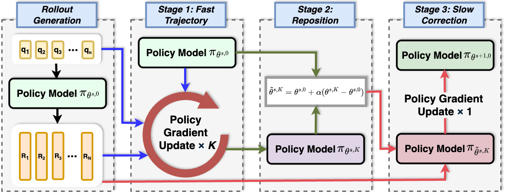

<h1>Slow-Fast Policy Optimization: Reposition-Before-Update for LLM Reasoning </h1>

[<a href="https://arxiv.org/abs/2510.04072">Paper</a>] | [<a href="https://zkbig.github.io/Slow_Fast_Policy_Optimization.github.io/">Website</a>]

  

## News
- **[2025.10.6]** Website released: [https://zkbig.github.io/Slow_Fast_Policy_Optimization.github.io/](https://zkbig.github.io/Slow_Fast_Policy_Optimization.github.io/).
- **[2025.10.6]** Paper preprint available on [https://arxiv.org/abs/2510.04072](https://arxiv.org/abs/2510.04072).

<!-- ---------- -->

## Abstract
Reinforcement learning (RL) has become central to enhancing reasoning in large language models (LLMs). Yet on-policy algorithms such as Group Relative Policy Optimization (GRPO) often suffer in early training: noisy gradients from low-quality rollouts lead to unstable updates and inefficient exploration. We introduce Slow-Fast Policy Optimization (SFPO), a simple yet efficient framework to address the above limitations via decomposing each step into three stages: a short fast trajectory of inner steps on the same batch, a reposition mechanism to control off-policy drift, and a final slow correction. This reposition-before-update design preserves the objective and rollout process unchanged, making SFPO plug-compatible with existing policy-gradient pipelines. Extensive experiments demonstrate that SFPO consistently improves stability, reduces number of rollouts, and accelerates convergence of reasoning RL training. Specifically, it outperforms GRPO by up to 2.80 points in average on math reasoning benchmarks. It also achieves up to 4.93× fewer rollouts and a 4.19× reduction in wall-clock time to match GRPO’s best accuracy.

