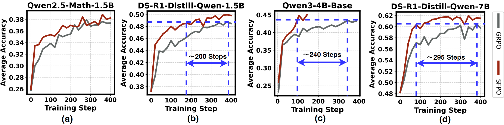
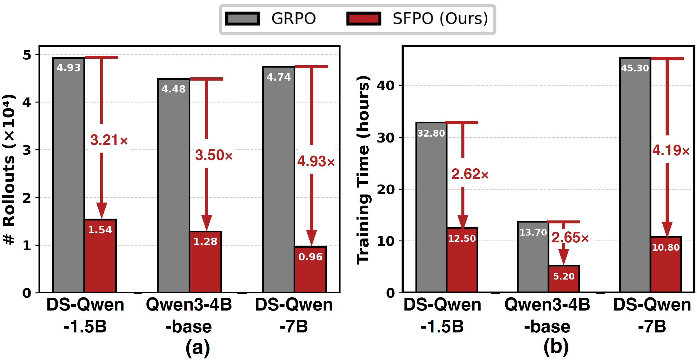

<div align="center">
<h1>Slow-Fast Policy Optimization: Reposition-Before-Update for LLM Reasoning</h1>

<p align="center">
  <a href="https://github.com/Urheen/SFPO">
    
  </a>
  <a href="https://arxiv.org/abs/2510.04072">
    
  </a>
  <a href="https://zkbig.github.io/Slow_Fast_Policy_Optimization.github.io/">
    
  </a>
</p>

</div>
<p align="center">
  
</p>

## 🔥 News
- **[2025.10.21]** Code released.
- **[2025.10.6]** Website launched: [https://Slow_Fast_Policy_Optimization/](https://zkbig.github.io/Slow_Fast_Policy_Optimization.github.io/).
- **[2025.10.6]** Paper preprint available on: [https://arxiv.org/abs/2510.04072](https://arxiv.org/abs/2510.04072).

---

## 🧠 Abstract

Reinforcement learning (RL) has become central to enhancing reasoning in large language models (LLMs). Yet on-policy algorithms such as Group Relative Policy Optimization (GRPO) often suffer in early training: noisy gradients from low-quality rollouts lead to unstable updates and inefficient exploration. 

We introduce **Slow-Fast Policy Optimization (SFPO)**, a simple yet efficient framework to address the above limitations via decomposing each step into three stages: 
- (1) a short *fast trajectory* of inner steps on the same batch, 
- (2) a *reposition* mechanism to control off-policy drift, 
- (3) and a final *slow correction*. 

This **reposition-before-update** design preserves the objective and rollout process unchanged, making SFPO plug-compatible with existing policy-gradient pipelines. Extensive experiments demonstrate that SFPO consistently improves stability, reduces number of rollouts, and accelerates convergence of reasoning RL training. Specifically, it outperforms GRPO by up to 2.80 points in average on math reasoning benchmarks. It also achieves up to 4.93× fewer rollouts and a 4.19× reduction in wall-clock time to match GRPO’s best accuracy.

---

## 📊 Results

<div align="center">
<p align="center">
  
</p>
</div>

</div>
<p align="center">
  
</p>

Our SFPO can reach GRPO’s best performance at the early stage of training, thereby significantly reducing the number of rollouts required compared to GRPO and further saving computational budget.

---

## 🚀 Getting Started
Our implementation is based on 
- [volcengine/verl](https://github.com/volcengine/verl), 
- [Infini-AI-Lab/GRESO](https://github.com/Infini-AI-Lab/GRESO), and 
- [SkyworkAI/Skywork-OR1](https://github.com/SkyworkAI/Skywork-OR1).

---

### Environment Setup & Data Preparation
Please refer to the official environment setup and data preparation guides of 
[Infini-AI-Lab/GRESO](https://github.com/Infini-AI-Lab/GRESO) and 
[SkyworkAI/Skywork-OR1](https://github.com/SkyworkAI/Skywork-OR1) for details.

---

### Training ⚙️

#### For GRESO

Train Qwen 1.5b with SFPO
```bash
bash train-scripts/math_qwen_1_5b_dm_sfpo.sh
```

Train Qwen 7b with SFPO
```bash
bash train-scripts/math_qwen_7b_dm_sfpo.sh
```

Train Qwen3 4b with SFPO
```bash
bash train-scripts/qwen3_4b_dm_sfpo.sh
```

See more scripts in the `train-scripts` folder.

#### For Skywork-OR1
We use the official repo of Skywork-OR1 for rl training: [https://github.com/SkyworkAI/Skywork-OR1](https://github.com/SkyworkAI/Skywork-OR1)

---

## ⚖️ Evaluation
We follow the work [GRESO](https://github.com/Infini-AI-Lab/GRESO) that reports the performance of the checkpoint that obtains the best average performance on six benchmarks. Specifically, we evaluate all models with temperature = 1 and report pass@1(avg@4) for all benchmarks.

---

## 🧩 Integrating SFPO into Your Framework

### 1️⃣ Using the VERL Framework
Simply replace the following files in your `verl` folder:
```bash
verl/trainer/ppo/ray_trainer.py
verl/workers/fsdp_workers.py
```
We provide demo versions in `Demo/`. 
If your project already modifies these files, see below for how to manually integrate SFPO.

### 2️⃣ Using Other Frameworks
If you are not using VERL, you can easily integrate SFPO by defining a new `sfpo_update_actor()` function parallel to your existing `update_actor()` function.

For example, in VERL, this is located at `verl/workers/fsdp_workers.py`:
```python
# Add the following function after update_actor() in verl/workers/fsdp_workers.py
@register(dispatch_mode=Dispatch.DP_COMPUTE_PROTO)
def sfpo_update_actor_demo(self, data: DataProto):
  ...

  with self.ulysses_sharding_manager:
    ...

    with torch.no_grad():
      slow_weights = [p.detach().clone() for p in self.actor_module_fsdp.parameters() if p.requires_grad]

    # stage 1: fast update
    with Timer(name='update_policy', logger=None) as timer:
      for _ in range(self.config.actor.sfpo_inner_steps):
        self.actor.update_policy(data=data)

    with torch.no_grad():
      fast_weights = [p.detach().clone() for p in self.actor_module_fsdp.parameters() if p.requires_grad]

    # stage 2: reposition
    with torch.no_grad():
      idx = 0
      for param in self.actor_module_fsdp.parameters():
        if not param.requires_grad:
          continue
        param_tmp = slow_weights[idx] + self.config.actor.sfpo_step_size * (fast_weights[idx] - slow_weights[idx])
        param.data.copy_(param_tmp)
        idx += 1

    # stage 3: slow correction
    with Timer(name='update_policy', logger=None) as timer:
      metrics = self.actor.update_policy(data=data)

    ...
```

Next, locate where this function is called (e.g., in `verl/trainer/ppo/ray_trainer.py`), and modify it as follows:
```python
# update actor
if self.config.actor_rollout_ref.actor.use_sfpo:
  with _timer('update_actor', timing_raw):
    actor_output = self.actor_rollout_wg.sfpo_update_actor(batch)
else:
  with _timer('update_actor', timing_raw):
    actor_output = self.actor_rollout_wg.update_actor(batch)
```

For more details, refer to the implementation in `Code/SFPO/verl/` to understand how SFPO is triggered and integrated into your project.

---

## 📚 Citation
If you find our work useful, please cite:
```bibtex
@article{wang2025slow,
  title={Slow-Fast Policy Optimization: Reposition-Before-Update for LLM Reasoning},
  author={Wang, Ziyan and Wang, Zheng and Fu, Jie and Qu, Xingwei and Cheng, Qi and Tang, Shengpu and Zhang, Minjia and Huo, Xiaoming},
  journal={arXiv preprint arXiv:2510.04072},
  year={2025}
}
```
